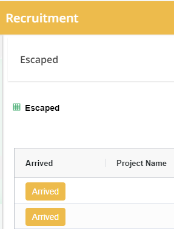

## **Introduction**

  Al Mawarid is a manpower recruiting company which is located in Saudi Arabia. This Recruiting company has recruit employees from different countries for different vacancies through the different agents or agencies. This Airport portal has the record of the conpany's side flight plan progress records of the selected candidate's each and every movements from the Airport reception to the Arrival status, Accomodation Reception and checkin passport status by passport reader in the company.

## **Airport Portal Login Page**

## **API** 

- Method - POST
- URL - https://portal.mawarid.com.sa/Recruitment//api/Auth/usertypetoken?user-id=r.admin

## Airport Portal displays the Dashboard cards integrated with link

## **SideBar Menu**

1. Dashboard

2. Airport Reception

3. Accomodation Reception

4. Not Arrived

5. Escaped

6. Received By Customer

## **Dashboard**

>  - In Dashboard, it displays the six dashboard cards named as `Airport  Reception, User Login Reports, Accomodation Reception, Not Arrived, Escaped, and Receive by Customer` which is inetagrated with link.

## **Airport Reception**

  (In General sense) Airport reception is a personalized service designed to enhance the arrival experience of individuals at an airport. Typically arranged in advance, this service involves a dedicated representative or service staff member meeting the arriving person at a specified location within the airport, often with a personalized sign. The representative assists with customs and immigration processes for international arrivals, helps with luggage retrieval, and arranges seamless transportation to the final destination, whether it's a hotel, conference venue, or another location. Airport reception goes beyond logistical support, providing valuable information about the local area and offering language assistance if needed. This tailored service aims to ensure a smooth and comfortable transition for travelers, contributing to a positive and stress-free beginning to their journey.

>  - In our Airport Portal application, Airport Reception shows the applicant's journey details while the applicant in the time of journey with the details of `visa number, passport number, flight number, airline, project name, arrival date and time` and the status of arrival. These datas are related with `Accomodation Reception, Not arrived, Escaped and Received by Customer.`
>  - While clicking the `Arrived` button in Airport Reception, the data will also reflect or show a copy of data in the `Accomodation Reception` page, which represents that the candidate has been arrived.
>  - While clicking the `Not Arrived` button, the data will shown in the `Not Arrived` page, which represents the candidate has not arrived. 

## **API** 

- Method - GET
- URL - https://portal.mawarid.com.sa/Recruitment/api/v1/recruitment/airport/getArrivingFlightLinesByMawarid?_Company=MWD  

## **Accomodation Reception** 

  (In General sense) Accommodation reception is a fundamental aspect of the hospitality industry, encompassing the welcoming and check-in process for guests at hotels, resorts, or other lodging facilities. This pivotal service involves a dedicated reception or front desk area where guests are greeted upon arrival. The accommodation reception staff assists with the check-in procedure, providing essential information about the facility, room amenities, and any additional services available. Guests may also receive keys or key cards during this process. Beyond administrative tasks, accommodation reception personnel play a vital role in ensuring guests feel welcome and addressing any immediate queries or concerns. This initial interaction sets the tone for the guest's stay, emphasizing the importance of friendly and efficient service in creating a positive and memorable experience for those seeking temporary lodging.

  

>  - In our Airport Portal application, Accomodation Reception holds the details of an applicant, while an applicant reach the company's accomodation, it shows the detailed descriptions like in the Airport Portal. (For instance, visa number, passport number, etc.,)
>  - While clicking the `Arrived` button in Accomodation Reception, the data will shown in the `Received by Customer` page, which represents that the candidate has been arrived the Accomodation Reception.
>  - While clicking the `Not Arrived` button, the data will shown in the `Not Arrived` page, which represents the candidate has not arrived.

## **API** 

- Method - GET
- URL - https://portal.mawarid.com.sa/Recruitment/api/v1/recruitment/airport/getArrivingFlightLines?_Company=MWD  

## **Not Arrived**

  (In General sense) The non-arrival of an employee in the recruitment process refers to a situation where a candidate who was expected to join a company or organization fails to commence employment as scheduled. This occurrence can pose challenges for the hiring process, requiring the employer to reevaluate staffing needs, identify potential reasons for the candidate's non-arrival, and possibly revisit the recruitment strategy. Common reasons for a candidate's non-arrival may include alternative job offers, personal circumstances, or unforeseen changes in plans. Employers often need to maintain open lines of communication with candidates to understand the reasons behind their decisions and, when necessary, initiate backup plans to fill the vacant position promptly. This aspect of recruitment underscores the dynamic and occasionally unpredictable nature of the hiring process, necessitating flexibility and adaptability on the part of employers.

  

>  - In our Airport Portal application, Not Arrived menu shows the arrival status of an applicant, whether he is not arrived or escaped, depends on the arrival status. It reflects in `Escaped` page also.
>  - While clicking the `Arrived` button in the Not Arrived page, the data will reflect or shown in the `Accomodation Reception` page, which represents the candidate has been arrived.
>  - While clicking the `Escaped` button in the Not Arrived page, the data will reflect or shown in the `Escaped` page, which represents the candidate has escaped.

## **API** 

- Method - GET
- URL - https://portal.mawarid.com.sa/Recruitment/api/v1/recruitment/airport/getNotArrivedFlightLines?_Company=MWD  

## **Escaped**

  (In General Sense) An "Escaped employee" typically refers to an individual who has departed from their employment without giving proper notice or obtaining authorization, often in an unexpected or sudden manner. This departure can present challenges for employers, as it can disrupt workflow, result in the loss of valuable institutional knowledge, and require a prompt replacement. The reasons for an employee's "absconding" can vary and may include job dissatisfaction, finding a better opportunity elsewhere, or personal circumstances. Employers are responsible for managing the aftermath by conducting exit interviews to understand the underlying motivations, addressing any organizational issues that may have contributed to the departure, and devising strategies to fill the vacant position in order to maintain operational continuity. Dealing with an absconded employee requires a proactive and strategic approach to minimize the impact on the workplace.

  

>  - In our Airport Portal application, If an applicant escaped, it holds the data of an escaped applicant's `name, visa number, passport number, etc,.` These datas are comes from the `Airport reception and Not arrived menu.`
>  - While clicking the `Arrived` button in the Escaped page, the data will reflect in the `Accomodation Reception` page, which represents the candidate has been arrived.

## **API** 

- Method - GET
- URL - https://portal.mawarid.com.sa/Recruitment/api/v1/recruitment/airport/getEscapedFlightLines?_Company=MWD  

## **Received by Customer**

  (In General sense) In the context of recruitment, "received by customer" typically refers to the acknowledgment or acceptance of a candidate by the hiring organization or employer. This crucial stage occurs when a candidate successfully passes through the recruitment process and is officially welcomed into the company. The "received by customer" milestone involves the completion of administrative tasks, such as signing employment contracts, conducting orientation sessions, and facilitating the onboarding process. It signifies the beginning of the employee's journey with the organization, highlighting the successful alignment of the candidate's skills and qualifications with the employer's needs. Ensuring a smooth transition from recruitment to onboarding is essential for fostering a positive employee experience and setting the stage for a productive and mutually beneficial professional relationship.

>  - It holds the details of an applicant, if the customer received an applicant directly from the airport. Also it holds the all details of an applicant like project name, visa number, passport number, etc,. Which the details are from the `Airport reception, Not Arrived and Escaped menu.`

## **API** 

- Method - GET
- URL - https://portal.mawarid.com.sa/Recruitment/api/v1/recruitment/airport/getArrivingFlightLinesByCustomer?_Company=MWD  

## **Passport Reader**

  In a recruitment company, a passport reader serves as a valuable tool for expediting the verification and onboarding processes. This technology enables efficient extraction of information from candidates' passports, streamlining the documentation and identity verification steps during the recruitment phase. Passport readers can quickly capture and verify essential details, such as personal information and identification numbers, ensuring accuracy and compliance with legal requirements. This enhances the overall efficiency of the recruitment process, reducing manual data entry errors and expediting the completion of administrative tasks. Additionally, by automating the passport verification process, recruitment companies can enhance their ability to conduct thorough background checks and maintain a secure and organized record-keeping system for each candidate.

>  - Passport Reader scan and record the applicant's passport details after the arrival.

## **API** 

- Method - GET
- URL - https://portal.mawarid.com.sa/Recruitment/api/v1/entitytype/dynamic/get/?entityTypeRecId=77&$page=1&$size=10  

## **API Collections**

[Click here](./Airport%20Portal%20or%20Recruitment%20Portal.postman_collection.json) to view the API collections. In this collection, it has a full API collections of Airport Portal.
